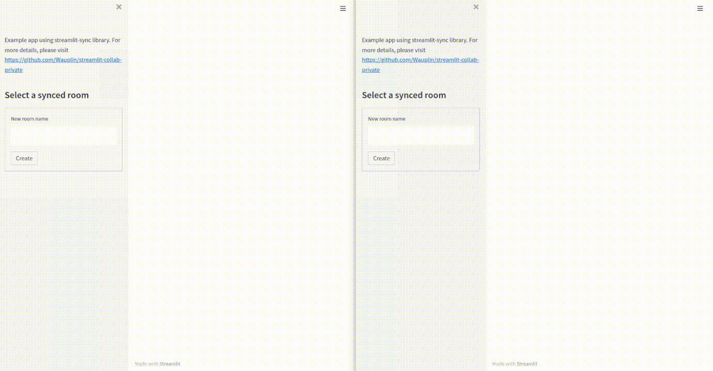

# streamlit-sync

A library to easily synchronize dashboards across streamlit sessions.

```py
import streamlit as st

import streamlit_sync

room_name = streamlit_sync.select_room_widget()

with streamlit_sync.sync(room_name):
    y = st.slider("Select a value")
    st.write(y, "squared is", y * y)
```

A more complete example app can be found in `./toy_example.py`.



# Why ?

The initial goal was to be able to share a dashboard on which anyone can interact. Each user sees the effects of other users on their dashboard.

Potential use cases are:
- In a meeting/presentation, it can be a solution to avoid having 1 user sharing its screen to others and making all the manipulations.
- Small games or chats can be implemented this way.
- It can be a way to "save" locally exact interesting parameters for a presentation. At the moment, it is not possible to store sessions on local drive but it should be a simple improvement to have.
- etc.

# Disclaimers

## Use it at your own risk

- `streamlit-sync` is using internal APIs of Streamlit that are not meant to be public. It is not guaranteed that it will work on future versions.
- `streamlit-sync` is not designed to be particularly efficient. A synced version of your dashboard is an even better incentive to use streamlit caching.
- Robustness of this library is not guaranteed when used with a lot of concurrent sessions.
- `streamlit-sync` is not well covered by tests. It would require to have end-to-end tests with several sessions but that's not done.

## Related work

([streamlit-server-state](https://github.com/whitphx/streamlit-server-state)) is another library doing a similar job. It is used to have server-side state. The idea of `streamlit-sync` is to also sync the widgets themselves.

# Features

## Thread-safety

Each room uses its own lock (from python `threading` lib). Only 1 session per room can read/write the values of the room at a time. I don't know how this would impact the usability if a large amount of sessions are connected to the same room.

Each room keeps in memory the latest snapshot of values with a timestamp. A session can only update a value if it already had the latest data. This means if 2 different sessions make an action on the dashboard at the same time, 1 action will most likely be lost.
## How to handle rooms ?

In order to sync data, you need to enter a room. The easiest way of doing it is to use the same room for every session.

```py
import streamlit as st

import streamlit_sync

with streamlit_sync.sync("default_room"):
    app()
```

### Select room from the UI

#### With the default UI

An alternative is to select the room to enter directly from the UI using the `streamlit_sync.select_room_widget()` method. It will create a simple form on the sidebar in which you can choose an existing room from the list or create a new one. Once in a room, you can exit from it. Values of the room are still kept on the server but removed from the session.

```py
import streamlit as st

import streamlit_sync

room_name = streamlit_sync.select_room_widget()

with streamlit_sync.sync(room_name):
    app()
```

**Note:** the number of active sessions per room is indicative must not always exact. If a session closes, the server will notice it only when another session with trigger a sync in this room.

#### Build your own UI

Instead of using the default UI with `select_room_widget`, you can build your own using `streamlit_sync.rooms.enter_room(room_name)` and `streamlit_sync.rooms.exit_room()`.

## How to sync only specific widgets/values ?

By default, all widgets and values are synced. It is possible to restrain some widget as "private" by defining its own not-synced key:

```py
x = st.slider("Select a value", key=streamlit_sync.get_not_synced_key("key"))
```

The same is also possible for state values:
```py
synced_key = "my_custom_key"
username = streamlit_sync.get_not_synced_key("username")

st.session_state[synced_key] = 42 # All sessions will be synced with this value
st.session_state[username] = "Adrien Treuille" # Each session can store its own username
```

## Action widgets

Some widgets are processed a bit differently by streamlit-sync, in particular buttons and form.

### Buttons

To avoid duplicate actions, buttons are never synced with the room. In order to sync a button, you will need to set a state value.


In this example, balloons with be send only on the session that clicked the button.
```py
# Action is not shared !
if st.button(label="Send balloons"):
    st.balloons()
```

Here is an example that syncs the result of the action.
```py
# Nb of clicks is synced, not the action. !
if st.session_state.get("NB_CLICKS") is None:
    st.session_state["NB_CLICKS"] = 0

if st.button(label="click"):
    st.session_state["NB_CLICKS"] += 1

st.write("Clicked **" + str(st.session_state["NB_CLICKS"]) + "** times !")
```

### Forms

Form data is synced only when the submit button is clicked, which is the intended use of forms. Same as for the buttons, the "submit action" is not synced, only the data.

**Note: there is currently a bug in how the forms are synced. The fields are cleared only in the session that submitted the data.**
# Future improvements

- Test the library and especially the UI. At the moment, the sync between 2 sessions is only manually tested.
- Make an option to sync/not sync values by default. At the moment, all values are synced by default except if explicitly mentioned as "not synced". If would be good to be able to optionally set all values as private except if explicitly synced.
- Store state on local drive. That is one of the main purpose why I built this tool. The idea would be to be able to store and retrieve streamlit sessions even after a restart. It will most likely work only on pickle-able data.
- Have a read-write/read-only mechanism with which some "admin" sessions could interacts with the widgets and some "normal users" could just see the current dashboard.
- Any other ideas are welcome :)